# AgileXDemo

基于松灵机器人的tracer2.0和piper构建的移动抓取机器人mobile_manipulator2，架构和各个模块设计如下。

## 系统架构

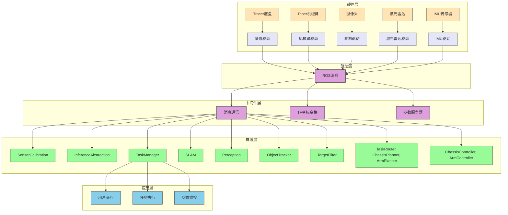

系统架构图例：
- 🟨 **黄色模块**：硬件层组件
- 🟪 **紫色模块**：驱动层组件
- 🟪 **淡紫色模块**：中间件层组件
- 🟩 **绿色模块**：算法层组件
- 🟦 **蓝色模块**：应用层组件

移动抓取机器人系统采用分层模块化架构设计，整体分为硬件层、驱动层、中间件层、算法层和应用层五个层次：

### 1. 硬件层
- 底盘：Tracer底盘，提供移动能力
- 机械臂：Piper机械臂，提供抓取能力
- 传感器：
  - 多个摄像头（topCamera、handCamera、chassisCamera）
  - 激光雷达（chassisLidar）
  - IMU传感器

### 2. 驱动层
- 底盘驱动：控制Tracer底盘的运动
- 机械臂驱动：控制Piper机械臂的关节运动
- 相机驱动：获取各摄像头的图像数据
- 激光雷达驱动：获取环境点云数据
- IMU驱动：获取惯性测量数据

### 3. 中间件层
- 基于ROS/ROS2的消息通信机制
- TF坐标变换系统
- 参数服务器
- 服务和动作服务器

### 4. 算法层
- 传感器标定模块 (SensorCalibration)
- 推理抽象模块 (InferenceAbstraction)
- 任务管理模块 (TaskManager)
- 定位与建图模块 (SLAM)
- 感知与识别模块 (Perception)
- 目标跟踪模块 (ObjectTracker)
- 目标过滤模块 (TargetFilter)
- 路径规划模块 (TaskRouter, ChassisPlanner, ArmPlanner)
- 运动控制模块 (ChassisController, ArmController)

### 5. 应用层
- 用户交互接口（UI、命令行、语音）
- 任务执行引擎
- 状态监控与可视化

整个系统采用分布式架构，各模块之间通过ROS消息进行通信，支持离线标定和在线推理两种模式，确保系统的灵活性和可扩展性。各模块间的数据流如下：
1. 传感器数据通过驱动层采集，经标定后输入到各算法模块
2. SLAM模块融合IMU和激光雷达数据进行定位建图
3. Perception模块处理图像数据进行物体识别和位姿估计
4. ObjectTracker模块对多传感器感知结果进行融合和跟踪
5. TargetFilter模块对跟踪结果进行后处理和过滤
6. TaskRouter模块基于过滤后的目标规划最优拾取路径
7. TaskManager协调各模块完成任务规划和执行
8. Planner模块根据任务和环境信息规划运动轨迹
9. Controller模块执行轨迹控制

模块间主要数据流：

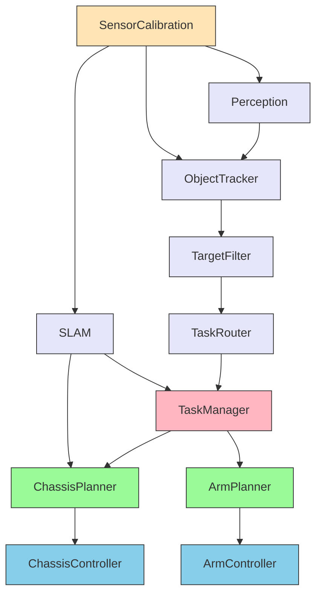

图表说明：
- 🟨 **黄色模块**：基础模块 (SensorCalibration)
- 🟪 **紫色模块**：感知与识别模块 (SLAM, Perception, ObjectTracker, TargetFilter, TaskRouter)
- 🟪 **粉色模块**：任务管理模块 (TaskManager)
- 🟩 **绿色模块**：路径规划模块 (ChassisPlanner, ArmPlanner)
- 🟦 **蓝色模块**：运动控制模块 (ChassisController, ArmController)

## 模块设计

### 模块间数据流详情

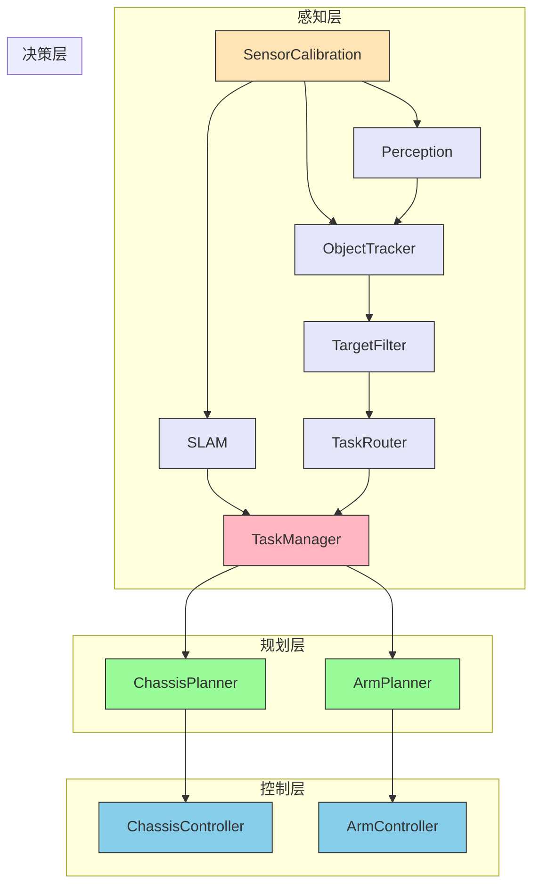

### 1. 基础模块

#### SensorCalibration（offboard）

**类型：** component

**功能：传感器标定**
- 标定topCamera、handCamera、chassisCamera的内参
- 标定topCamera、handCamera、chassisCamera，chassisLidar的外参
- 提供相机和激光雷达到底盘坐标系的坐标变换矩阵

**内部数据流：**

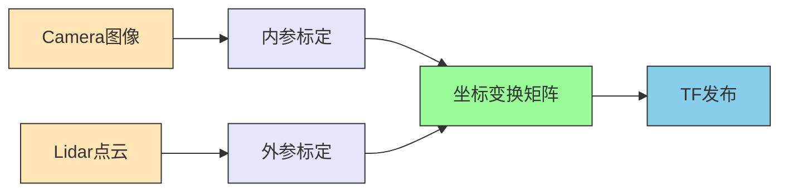

**输入：Camera图像和lidar点云数据**
- /camera/top/dual/color/image_raw（格式可能是YUV，待确定）
- /camera/hand/dual/color/image_raw
- /camera/chassis/dual/color/image_raw
- /lidar/chassis/point_cloud（x, y, z）

**输出：camera，lidar到底盘坐标系的坐标转换矩阵**
- /tf/topcamera2chassis
- /tf/handcamera2chassis
- /tf/chassiscamera2chassis
- /tf/lidar2chassis

#### InferenceAbstraction

**类型：** component

**功能：**
- 模型推理引擎自动构建（跨平台）
- 推理引擎统一封装（跨平台）
- AI算子库（CPU，GPU算子优化）
- 支持多种模型格式的推理（ONNX、TensorRT等）

**模型推理引擎自动构建（跨平台）：**
- 输入：model.onnx
- 输出：tensorrt engine(ORIN平台)

**推理引擎统一封装（跨平台）**
- 输入：
  - config：model_type(int8, fp16)，batch_size
  - model_pth：model engine path
  - Image：
    - /camera/top/dual/color/image_raw
    - /camera/hand/dual/color/image_raw
    - /camera/chassis/dual/color/image_raw
- 输出：
  - model_output

### 2. 功能模块

#### TaskManager

**类型：** component

**功能：**
- 接收和处理指令：如"开始扫描建图"、"从A点抓取物体如瓶子，放置到B点(现阶段默认放在固定目标位置点"、"停止"、"继续"等；包括多种形式如UI指令、命令行指令，或者语音指令；并解析和识别指令，如果必要与用户进一步交互确认等；
- 任务拆解和规划：拆解指令任务成内部可执行的子任务或子技能指令、规划子任务流程或子技能等
- 状态追踪和处理：监控当前任务状态、环境信息和机器人状态，驱动各个子模块执行子任务或目标，并处理异常状态等
- 协调各模块完成整体任务执行

**内部数据流：**

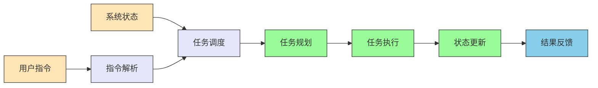

**输入：**
- 用户交互信息 (暂定json形式)
  - /user/cmd  
  - /user/ui 
  - /user/speech 
- 状态信息
  - /arm/joint_state
  - /chassis/chassis_state
  - /router/target_list

**输出：**
- /task_mgr/fsm_state
- /task_mgr/task_list
- /task_mgr/cur_task (cur_task_id, cur_task_name, cur_stage, cur_goal)
- /task_mgr/target_object

#### SLAM

**类型：** component

**功能：** 实时构建2D和3D环境地图，支持SLAM，适应动态环境，目前计划采用松灵提供的激光SLAM
- 核心组件：Cartographer（2D/3D SLAM）、OctoMap（3D占用网格）
- 实现：SLAM节点，融合传感器数据生成地图，发布坐标变换/tf
- 帧率：10 Hz（基于IMU和激光雷达数据更新频率）

**内部数据流：**

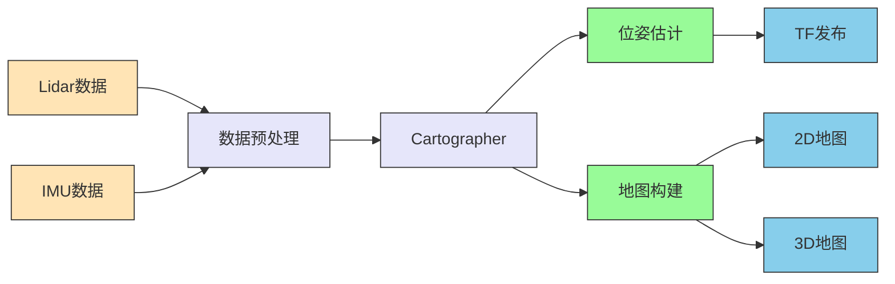

**输入：**
- /lidar/chassis
- /imu/data（IMU原始数据）

**输出：**
- /map/occupancy_grid（2D地图）
- /map/octomap（3D地图）
- /chassis/pose（底盘位姿）

#### Perception 

**类型：** component

**功能：** 主要感知划定区域内的矿泉水瓶，玩具等泛化物体，感知抓取对象的抓取点检测 如3D bbox 和 位姿6D Pose
- 核心组件：OpenCV（图像处理）、PCL（点云处理）、YOLO（目标检测）。
- 实现：感知节点，运行视觉和点云算法，发布物体信息。
- 需要实现yuv转bgr，crop resize等功能
- 帧率：15 Hz（基于相机数据更新频率）

**内部数据流：**

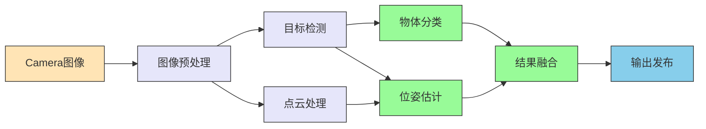

**输入：**
- /camera/top/dual/color/image_raw
- /camera/hand/dual/color/image_raw
- /camera/chassis/dual/color/image_raw

**输出：**
- /vision/object_list[]/obj_x
  - /classification
  - /attribute
  - /pose
  - /key_points or /shape
  - /confidence_threshold
  - or /graspness (见下文 Arm Planner 对 Perception的 grasp需求)

#### ObjectTracker

**类型：** component

**功能：** 多传感器目标融合(主要是topcamera和chassiscamera感知到的物体进行融合)，目标跟踪tracking，ekf方案
- 对多传感器感知结果进行数据融合和时间关联
- 使用EKF算法对目标进行持续跟踪
- 帧率：30 Hz（基于感知数据更新频率）

**内部数据流：**

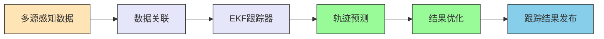

**输入：**
- /vision/object_list[]/obj_x
  - /classification
  - /attribute
  - /pose
  - /key_points or /shape
  - /confidence_threshold
  - or /graspness (见下文 Arm Planner 对 Perception的 grasp需求)

**输出：**
- /vision/tracking_list[]/obj_x
  - /classification
  - /attribute
  - /pose
  - /key_points
  - /confidence_threshold

#### TargetFilter

**类型：** component

**功能：** 物体感知跟踪和抓取点检测的结果后处理，过滤掉地面以上的物体，过滤掉无法抓取的大物体，过滤掉地图之外感知到的物体
- 对感知和跟踪结果进行后处理和过滤
- 移除不符合抓取条件的目标
- 帧率：30 Hz（与跟踪数据同步）

**实现：**

**输入：**
- /vision/tracking_list[]/obj_x
  - /classification
  - /attribute
  - /pose
  - /key_points or /shape
  - /confidence_threshold

**输出：**
- /vision/target_list/obj_x
  - /classification
  - /attribute
  - /pose
  - /key_points or /shape
  - /confidence_threshold

#### TaskRouter

**类型：** component

**功能：** 基于感知到的多个待抓取物体，规划最优多点拾取路径；对于通常少于 20-30节点的小规模TSP问题，可使用动态规划Held–Karp算法来解决；
参考：https://www.geeksforgeeks.org/dsa/travelling-salesman-problem-using-dynamic-programming/
- 根据目标列表规划最优抓取顺序
- 帧率：1 Hz（任务规划更新频率）

**输入：**
- /vision/target_list/obj_x
  - /classification
  - /attribute
  - /pose
  - /key_points or /shape
  - /confidence_threshold

**输出：**
- /router/target_list

#### ChassisPlanner

**类型：** component

**功能：** 根据接下来的抓取的目标物体位置、当前位姿、2D/3D障碍物占据地图，规划底盘最终位姿和运动路径，以及当前运动速度，驱动底盘行驶到目标物体附近；确保机器人停留在最适合抓取位置，并调整最佳位姿。
- 基于环境地图和目标位置规划底盘运动路径
- 生成速度控制指令驱动底盘运动
- 帧率：50 Hz（运动控制更新频率）

**内部数据流：**

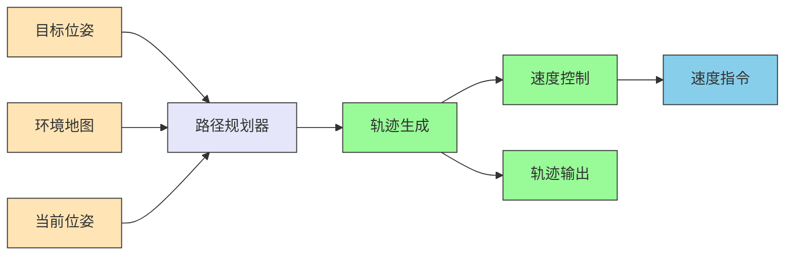

**输入：**
- /task_mgr/target_object/pose
- /map/occupancy_grid
- /map/octomap
- /chassis/pose

**输出：**
- /chassis/cmd_vel：
  - linear.x：0-1.0 m/s
  - angular.z：0-1.0 rad/s
- /chassis/trajectory (包括终态pose) 

#### ArmPlanner/RulebasedPlanner

**类型：** component

**功能：** 根据当前任务的抓取(pick)目标target的位姿(6D pose) 和 夹爪放置点(place)的位姿，规划操作轨迹（如RRT、DP/QP、OSQP平滑等）；操作轨迹要满足对本体结构 和 环境3d占用地图中的障碍物的避障
- 基于环境地图和目标位姿规划机械臂运动轨迹
- 考虑本体结构和环境障碍物进行避障
- 帧率：100 Hz（关节控制更新频率）

**内部数据流：**

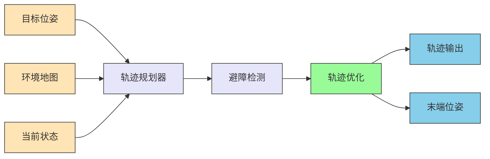

**输入：**
- /map/octomap（3D地图）
- /chassis/pose
- /task_mgr/target_object/pose
- /arm/joint_states（当前关节状态）

**输出：**
- /arm/trajectory（关节轨迹）
  - joint_names：关节名称
  - points：位置（rad），速度（rad/s）
- /arm/end_pose
  - x, y, z, roll, pitch, yaw

#### ChassisController

**类型：** component

**功能：** 执行底盘运动，管理硬件接口
- 接收速度控制指令并驱动底盘硬件执行
- 监控底盘状态并反馈给上层模块
- 帧率：100 Hz（硬件控制更新频率）

**输入：**
- /chassis/cmd_vel（底盘速度）

**输出：**
- /chassis/state

#### ArmController

**类型：** component

**功能：** 执行机械臂运动，管理硬件接口
- 接收轨迹控制指令并驱动机械臂硬件执行
- 监控机械臂状态并反馈给上层模块
- 帧率：100 Hz（关节控制更新频率）

**输入：**
- /arm/trajectory（机械臂轨迹）

**输出：**
- /arm/joint_state

## 总结

本设计文档详细描述了基于松灵机器人tracer和piper构建的移动抓取机器人的系统架构和模块设计。通过分层模块化架构，系统实现了以下特点：

1. **模块化设计**：各功能模块职责明确，便于独立开发和维护
2. **数据流清晰**：通过Mermaid图表直观展示了模块间的数据流向
3. **可扩展性强**：分层架构支持功能扩展和算法升级
4. **可视化支持**：丰富的图表帮助理解系统结构和数据流
5. **性能明确**：各模块定义了明确的类型和帧率参数，便于性能优化和系统调优

整个系统通过ROS消息机制实现模块间通信，确保了系统的灵活性和可维护性。所有模块均定义了清晰的输入输出接口和性能参数，为系统开发和调试提供了完整的信息。

## 算法子模块架构图

以下架构图展示了系统中各个算法子模块之间的数据流和拓扑关系：

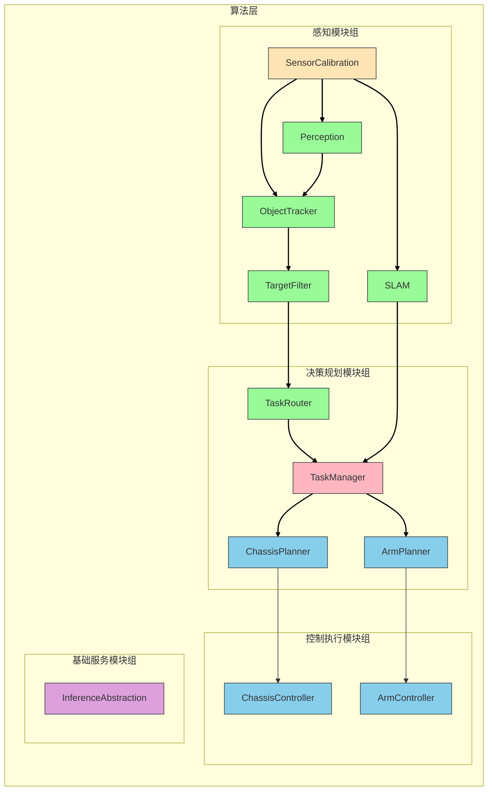

### 算法子模块详细数据流

以下图表详细展示了各算法子模块之间的数据流向和消息传递：

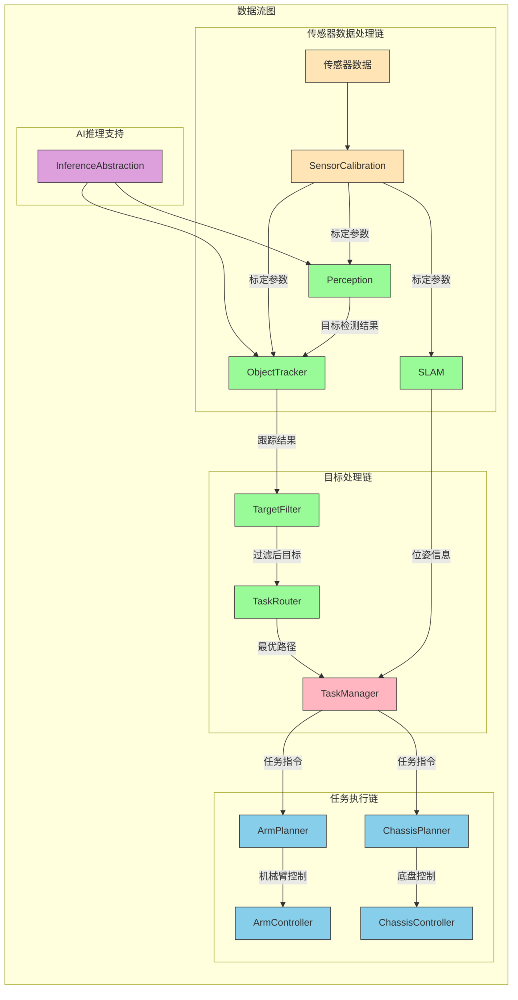

### 算法子模块拓扑关系总结

该系统架构体现了清晰的分层处理流程：

1. **感知层**：SensorCalibration为所有感知模块提供传感器标定服务，SLAM、Perception和ObjectTracker分别处理定位建图、目标识别和目标跟踪任务。

2. **处理层**：TargetFilter对跟踪结果进行过滤，TaskRouter基于过滤后的目标规划最优拾取路径。

3. **决策层**：TaskManager作为核心协调模块，接收路径规划结果并结合SLAM提供的位姿信息，向底盘和机械臂规划模块下发任务指令。

4. **执行层**：ChassisPlanner和ArmPlanner分别规划底盘和机械臂的运动轨迹，并由对应的Controller模块执行实际控制。

5. **支撑层**：InferenceAbstraction为感知模块提供AI推理支持。

各模块间通过ROS消息机制进行通信，形成了完整的数据处理和任务执行闭环。
